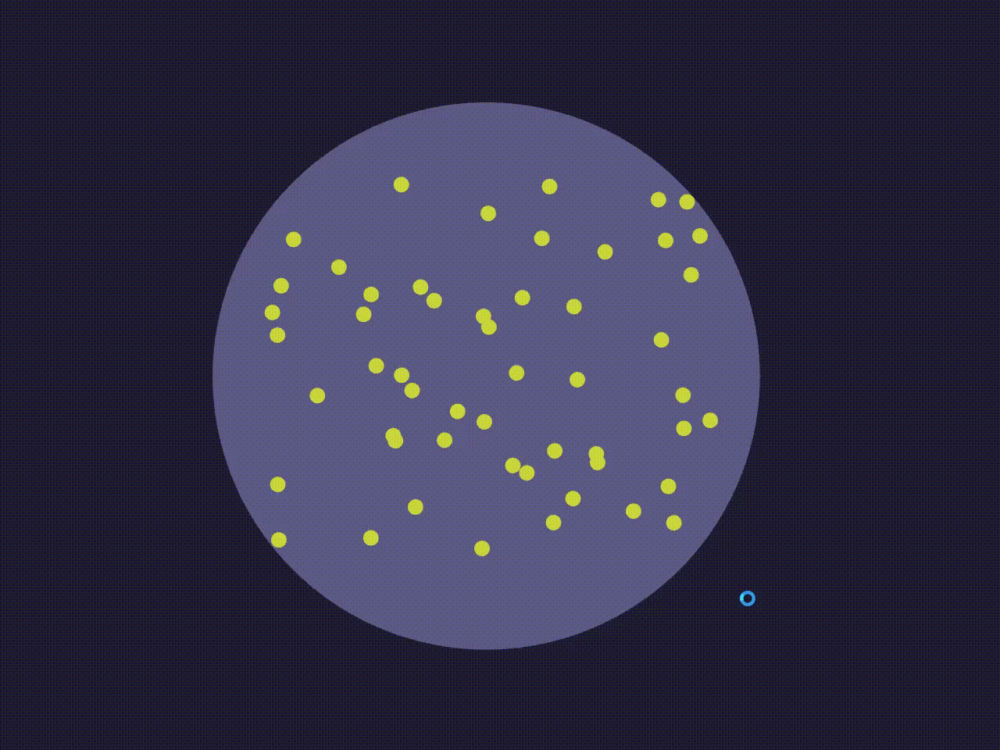
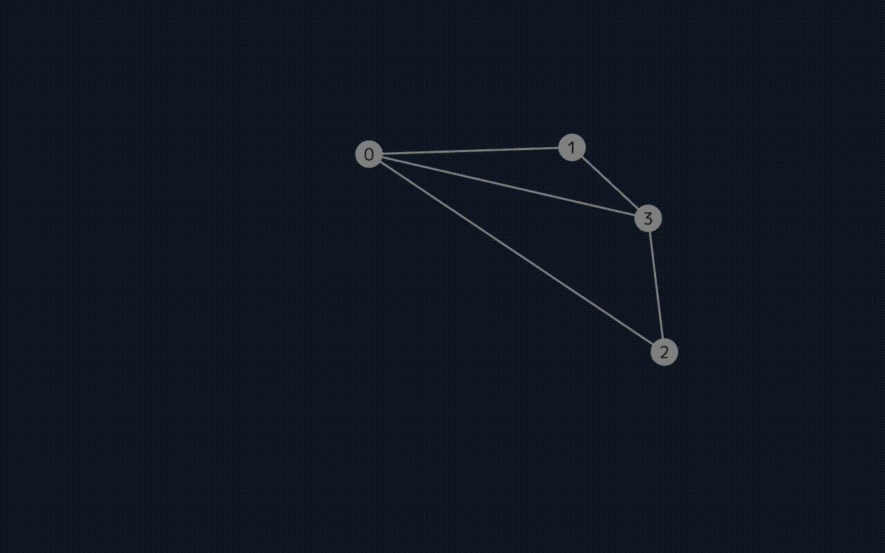

# Algorithm Visualiser for OpenSiv3D

## Contents
### MinimumInclusionCircle(最小包含円)
 



### Graph
#### example

```cpp
# include <Siv3D.hpp>
# include <Graph.hpp>
# include <queue>


void Main()
{	
	Window::Resize(Size(1280, 800));
	Array<Array<size_t>> g;
	for(size_t i = 0; i < 4; i++) g << Array<size_t>();
	g[0] << 1; g[0] << 2; g[0] << 3;
	g[1] << 0; g[1] << 3;
	g[2] << 0; g[2] << 3;
	g[3] << 0; g[3] << 2;

	ugis::Graph graph(g);
	graph.init(1280, 800, 20.0);

	while(System::Update())
	{	
		if(KeyA.down())
		{
			std::queue<std::pair<size_t, size_t>> que;
			que.push({0, 0});
			while(!que.empty())
			{
				size_t now, par;
				std::tie(now, par) = que.front();
				que.pop();
				if(graph.vertex[now].state != ugis::State::Unsearched) continue;

				ugis::Edge2D tmp(par, now);
				for(auto& edge : graph.edges) if(edge == tmp) edge.state = ugis::State::Confirmed;
				graph.vertex[now].state = ugis::State::Confirmed;
				graph.draw(true, 0.5);

				for(const auto& nxt : graph.connection[now])
				{
					if(graph.vertex[nxt].state != ugis::State::Unsearched) continue;
					que.push({nxt, now});
				}
			}
		}
		
		graph.draw();
	}
}
```